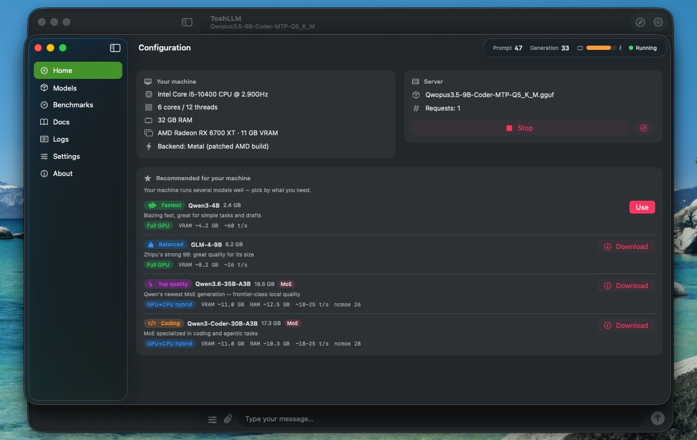
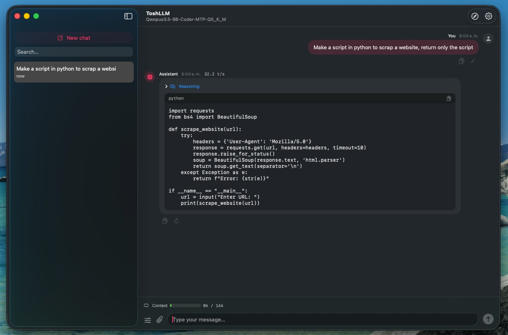
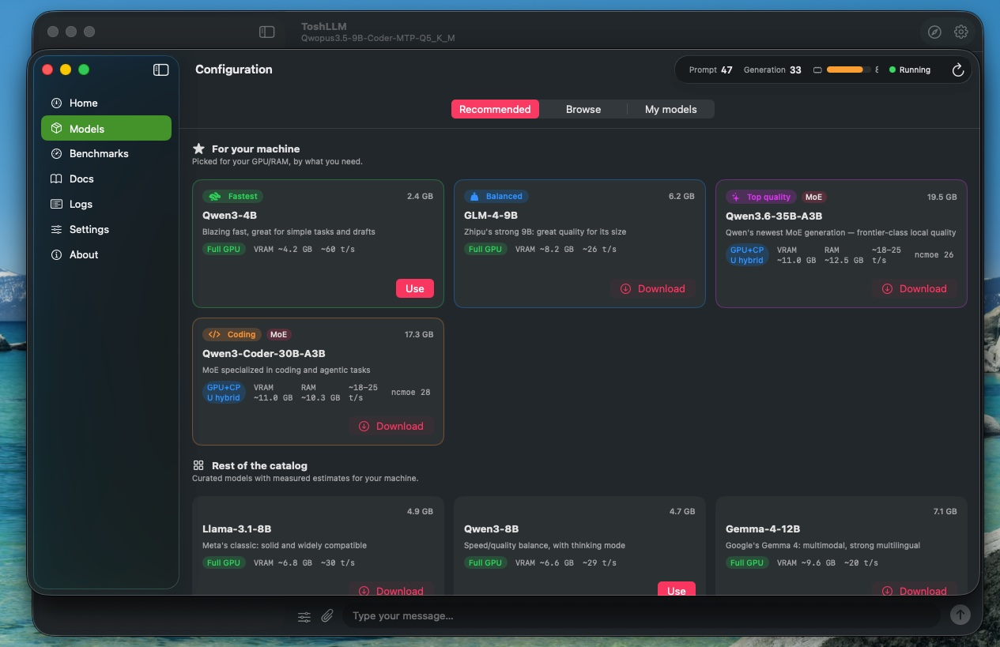
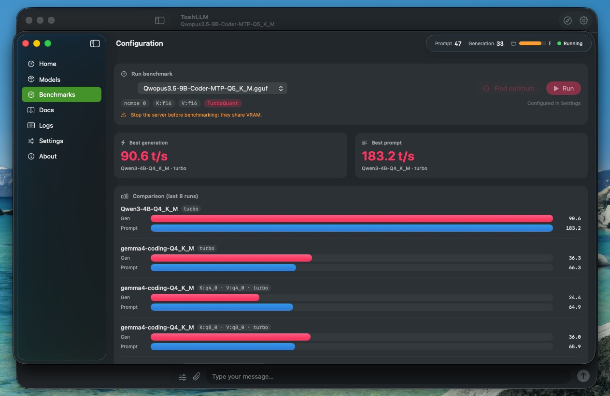

<div align="center">

# ToshLLM

**Run large language models locally on Intel Macs with AMD GPUs.**

Native macOS app · Metal acceleration · No cloud, no accounts, no per-token costs

[](https://github.com/engeldlgado/toshllm/actions/workflows/build.yml)
[](LICENSE)
[-lightgrey)](#requirements)
[](https://github.com/engeldlgado/toshllm/issues)

### [⬇️ Download the latest release](https://github.com/engeldlgado/toshllm/releases/latest) · [📝 Changelog](CHANGELOG.md)

*[Versión en español más abajo](#toshllm-en-español)*



</div>

---

## What is ToshLLM?

ToshLLM lets you run modern open LLMs **entirely on your own Mac** — your chats never leave the machine, there are no accounts, and there's nothing to pay per token.

Most local-LLM tools on macOS only target Apple Silicon. Intel Macs with discrete AMD GPUs — including Hackintosh builds — get left behind: the stock engines produce **corrupted output** on AMD dGPUs and read model weights over PCIe at a fraction of the possible speed.

**ToshLLM fixes that.** It bundles `llama.cpp` built with AMD-specific patches and wraps it in a polished native SwiftUI app — so a card like the RX 6700 XT goes from unusable to genuinely fast:

| | Stock llama.cpp on AMD dGPU | ToshLLM |
|---|---|---|
| Output | corrupted | correct |
| Qwen3-8B generation | 0.6–2.6 t/s | **~57 t/s** |
| Qwen3.6-35B (MoE) generation | unusable | **~26 t/s** (with MTP) |

It opens, detects your hardware, and recommends models that will actually run well — no guesswork.

## Features

- **Native chat** — multiple persistent conversations, full Markdown with code-copy, regenerate, system prompt, live tokens/sec, file attachments
- **Model manager** — a curated catalog with **per-model VRAM/RAM estimates for *your* hardware**, plus Hugging Face search, downloads with live progress, and one-click delete
- **MoE-aware** — automatic `--n-cpu-moe` calculation so 35B-class Mixture-of-Experts models run well on 12 GB GPUs
- **MTP speculative decoding** — +34% generation speed with compatible models, zero quality loss
- **Dual engines** — official llama.cpp + experimental **TurboQuant** engine (KV cache down to ~16%, 100k+ token contexts on 12 GB VRAM), with an optional **AMD Flash Attention kernel** that keeps decode attention on the GPU for quantized/turbo KV (see the [research note](#research-flash-attention-on-amd))
- **Benchmarks** — measure prompt/generation speed per configuration, with history and side-by-side comparison charts
- **OpenAI-compatible API** — use it from any client or library at `http://127.0.0.1:8080`
- **Every parameter explained** — bilingual tooltips and built-in docs (English/Spanish)
- **Profiles, menu bar mode, auto-start** — save full configurations and switch with one click

### A native chat that stays out of your way

Persistent conversations, Markdown with one-click code copy, and a live tokens/sec readout so you always know how fast the model is going.

<div align="center">
  
</div>

### Models picked for your machine

ToshLLM reads your GPU and RAM and suggests models by use case — fastest, balanced, top quality, coding — each with an honest estimate of how it'll run. Browse a curated catalog or search Hugging Face directly.

<div align="center">
  
</div>

### Measure it on your own hardware

The built-in benchmark runs prompt and generation tests for any configuration and charts them side by side, so you can find the sweet spot for your card.

<div align="center">
  
</div>

## Install

1. **[Download the latest `.dmg`](https://github.com/engeldlgado/toshllm/releases/latest)**, open it, and drag **ToshLLM** to Applications.
2. The app is fully self-contained — the inference engines ship inside the bundle. No Homebrew, no Python, nothing else to install.

> **First launch (Gatekeeper):** releases aren't notarized with an Apple
> Developer ID yet, so macOS blocks the first open. Go to
> **System Settings → Privacy & Security** and click **"Open Anyway"**, or run:
> ```bash
> xattr -dr com.apple.quarantine /Applications/ToshLLM.app
> ```
> You only need to do this once per update. Notarized releases are planned.

## Requirements

- macOS 14 or later
- An Intel Mac with an AMD GPU that supports Metal (developed and tuned on an RX 6700 XT 12 GB)
- 16 GB RAM minimum — 32 GB recommended for 35B-class MoE models

> **Hackintosh note:** AMD RDNA 2 dGPUs work great with the [NootRX](https://github.com/ChefKissInc/NootRX) kext providing Metal support. ToshLLM runs on top of any working Metal setup.

## Good to know

ToshLLM is **beta** and under active development. It's solid for daily use, but you may still hit rough edges — please report anything you find in [Issues](https://github.com/engeldlgado/toshllm/issues) (you can export diagnostics from **Settings → Server log**). Two limitations are worth knowing up front:

- **External clients (VS Code Copilot, Cline, Continue…):** these send a fixed 15–19k-token prompt (system instructions + tool definitions) with *every* request. On GPUs without Metal Flash Attention that means minutes of prompt processing per cold request, which saturates the GPU and can thermally throttle it. Recent versions mitigate this (single slot with resumable prefill, prompt-cache reuse, inline reasoning) and more is on the way. The built-in chat isn't affected — it only sends your conversation.
- **Large MoE models on AMD GPUs:** Mixture-of-Experts models that don't fully fit in VRAM (e.g. 26B/35B with `--n-cpu-moe` offload) shuttle data between GPU and CPU on every token. On discrete AMD GPUs under Metal this can eventually deadlock the driver mid-generation. ToshLLM ships a **watchdog** that detects the stall, frees memory, and suggests switching to a dense model. **Dense models (e.g. 8B, fully in VRAM) are stable and recommended**; large MoE-with-offload is best avoided. *(Characterized on an RX 6700 XT with the [NootRX](https://github.com/ChefKissInc/NootRX) kext; behavior may differ on other AMD setups.)*

## Build from source

Prerequisites: Xcode Command Line Tools (`xcode-select --install`), CMake.

```bash
git clone https://github.com/engeldlgado/toshllm
cd toshllm
./scripts/build-engines.sh      # clones llama.cpp, applies AMD patches, builds static engines
./make-app.sh                   # builds the SwiftUI app and packages dist/ToshLLM.app
./scripts/make-dmg.sh v0.81.1   # optional: create an installable DMG
```

The AMD patch lives in [`patches/`](patches/) — chunked staging transfers for Metal drivers that cap host-visible allocations (now also covering the asynchronous tensor read path that MTP exercises, which previously aborted mid-generation). The other key stability setting (`GGML_METAL_CONCURRENCY_DISABLE`) is already supported upstream and the app sets it automatically.

## Research: Flash Attention on AMD

A recurring limitation on discrete AMD GPUs under Metal is that **Flash Attention** is gated on hardware features these GPUs report as unavailable (`simdgroup matrix multiply`), and the upstream "vec" decode kernel miscompiles on RDNA 2 (it produces garbage even though each SIMD primitive is correct in isolation). The practical consequence: any quantized or `turbo*` KV cache **requires** Flash Attention, so on AMD that attention silently falls back to the CPU and generation collapses at longer contexts.

ToshLLM ships a from-scratch **AMD decode attention kernel** (Metal) as an opt-in toggle on the experimental engine. It keeps a deliberately simple structure (one `float4` slice of the head per SIMD lane, simdgroups splitting the KV stream, online-softmax merge) that was validated bit-for-bit against a CPU reference. It supports head dims **128, 256 and 512**, KV types **f16, q8_0, q4_0 and turbo2/3/4** (including the asymmetric pairs the TurboQuant engine allows), and is gated behind an environment flag so the default engine is unchanged.

The kernel splits the KV stream across as many simdgroups as the threadgroup-memory budget allows (32 for head dim 128, 16 for 256, 8 for 512 — the head dim Gemma 4's global layers use), turning the long serial decode loop into short parallel ones — a win that grows with context depth. On an RX 6700 XT with a turbo KV cache, generation at 4096 tokens of context improves from 19 → 33 t/s on an 8B (+75%) and 26 → 31 t/s on the 9B coder (+17%); at 2048 tokens, +42% and +11%. Prompt processing stays within ~3% and output is bit-for-bit unchanged.

Measured on an RX 6700 XT (decode, `tg`, llama-bench), GPU kernel vs the CPU fallback that quantized KV would otherwise force:

| Model / KV | context | CPU fallback | AMD kernel |
|---|---:|---:|---:|
| Qwen3-8B, f16 (head 128) | 1k | 7.1 t/s | **43.4 t/s** |
| Qwen3-8B, turbo3 (head 128) | 1k | 3.9 t/s | **30.3 t/s** |
| 9B coder, turbo3 (head 256) | 1k | 13.6 t/s | **30.8 t/s** |

The same kernel handles **prompt processing** too: although it is the "vec" decode kernel rather than the matrix-unit "mm" kernel a fully-equipped GPU would use for prefill, running it on the GPU still crushes the CPU fallback that quantized KV would otherwise force — and, unlike the CPU path, it stays flat with depth:

| KV (8B), prompt processing | pp2048 CPU | pp2048 AMD kernel |
|---|---:|---:|
| q8_0 | 40 t/s | **100 t/s** |
| turbo3 | 6 t/s | **97 t/s** |

It remains experimental and off by default. Vulkan/MoltenVK was also evaluated as an alternative backend and did not justify shipping (Metal wins on prompt throughput and matches generation).

## Performance reference

Measured on RX 6700 XT (12 GB) + DDR4, macOS:

| Model | Configuration | Prompt (t/s) | Generation (t/s) |
|---|---|---:|---:|
| Qwen3-8B Q4 | all-GPU | 101 | 57 |
| Qwen3.6-35B-A3B Q4 | MoE hybrid (`ncmoe 24`) | 123 | 18.6 |
| Qwen3.6-35B-A3B Q4 | + MTP speculative | — | **25.7** |
| Qwen3.6-35B-A3B Q4 | TurboQuant XL context | 68 | 15.7 |

Hybrid-MoE generation is RAM-bandwidth-bound: DDR5 systems roughly double these generation numbers.

### TurboQuant engine + AMD Flash Attention

Best result per model on the experimental TurboQuant engine with the AMD Flash-Attention kernel enabled — it keeps attention on the GPU across head dims 128/256/512, including Gemma 4's head-dim-512 global layers (auto-enabled), which otherwise fall back to the CPU:

| Model | Attention | Prompt (t/s) | Generation (t/s) |
|---|---|---:|---:|
| Qwen3-4B Q4 | head 128 | 183 | **91** |
| Qwen3-8B Q4 | head 128 | 106 | **59** |
| Gemma-4 12B Q4 | head 512 | 66 | **36** |
| Qwen3.6-35B-A3B Q4 | MoE hybrid (`ncmoe 28`) | 111 | **17** |

### Community benchmarks

Contributed by users running the built-in **Qwen3-4B (Q4_K_M)** benchmark on their own hardware:

| GPU | System | Prompt (t/s) | Generation (t/s) |
|---|---|---:|---:|
| Radeon RX 6900 XT 16 GB | Mac Pro 2019 — Xeon W 16-core, 96 GB DDR4 (genuine Mac) | 291.4 | 97.5 |
| Radeon RX 5600 XT 6 GB | Hackintosh — Core i5-12400F, DDR5 | 100.0 | 52.1 |

Running the **Qwen3-4B (Q4_K_M)** benchmark and sharing your numbers (GPU + system) in an issue is the easiest way to help — it grows this table for everyone.

## Architecture

```
ToshLLM.app
├── SwiftUI app (this repo) — UI, server lifecycle, downloads, estimator, benchmarks
└── Resources/
    ├── bin/        llama-server + llama-bench  (official, AMD-patched, static)
    ├── bin-turbo/  experimental TurboQuant engine (optional)
    └── test-ui/    minimal web chat served by llama-server
```

The app manages `llama-server` as a child process and talks to its OpenAI-compatible API. Hardware detection uses `sysctl` + Metal device enumeration; VRAM telemetry comes from IOKit.

## Contributing

Issues and pull requests are welcome — see [CONTRIBUTING.md](CONTRIBUTING.md). Please keep in mind the license below.

## License

**GPL-3.0** — see [LICENSE](LICENSE).

Free to use, study, modify and redistribute. Any distributed derivative must remain GPL-3.0 and preserve the copyright notice — the project can never be turned into closed-source commercial software.

## Credits

- [llama.cpp](https://github.com/ggml-org/llama.cpp) (ggml-org) — inference engine
- [iRon-Llama](https://github.com/Basten7/iRon-Llama-RC1) (Basten7) — Metal-on-AMD research for Intel Macs
- Developed by **Engelbert Delgado** ([@engeldlgado](https://github.com/engeldlgado))

## Support the project

If ToshLLM is useful to you:

- **Binance Pay**: alias `engeldlgado`
- **USDT (TRC-20)**: `TFUG271bbbQEmFu4wkFHyvNNkYRZC5JDUf`

---

## ToshLLM en español

**Ejecuta modelos de lenguaje grandes localmente en Macs Intel con GPU AMD.** Aceleración Metal. Sin nube, sin cuentas, sin costos por token.

### [⬇️ Descarga la última versión](https://github.com/engeldlgado/toshllm/releases/latest) · [📝 Cambios](CHANGELOG.md)

### ¿Qué es ToshLLM?

ToshLLM te permite ejecutar modelos LLM modernos **completamente en tu propio Mac** — tus chats nunca salen del equipo, no hay cuentas y no pagas por token.

Casi todas las herramientas de LLM locales en macOS apuntan a Apple Silicon; los Macs Intel con GPU AMD dedicada (incluidos los Hackintosh) quedan fuera: los motores estándar producen **texto corrupto** en estas GPUs y leen los pesos por PCIe a una fracción de la velocidad posible.

**ToshLLM lo resuelve.** Empaqueta `llama.cpp` con parches específicos para AMD dentro de una app nativa SwiftUI, de modo que una tarjeta como la RX 6700 XT pasa de inservible a realmente rápida (Qwen3-8B: de 0.6–2.6 t/s a ~57 t/s). Al abrirla detecta tu hardware y te recomienda modelos que correrán bien, sin adivinar.

### Funciones

- **Chat nativo** — conversaciones persistentes, Markdown completo con copiar código, regenerar, prompt de sistema, tokens/seg en vivo y adjuntar archivos
- **Gestor de modelos** — catálogo curado con **estimaciones de VRAM/RAM para *tu* equipo**, búsqueda en Hugging Face, descargas con progreso y borrado en un clic
- **Soporte MoE** — cálculo automático de `--n-cpu-moe` para que modelos de 35B corran bien en GPUs de 12 GB
- **Decodificación especulativa MTP** — +34% de velocidad de generación sin pérdida de calidad
- **Motores duales** — llama.cpp oficial + motor experimental **TurboQuant** (caché KV hasta ~16%, contextos de 100k+ tokens), con kernel opcional de **Flash Attention para AMD**
- **Benchmarks** — mide velocidad de prompt y generación por configuración, con historial y gráficas comparativas
- **API compatible con OpenAI** en `http://127.0.0.1:8080`
- **Cada parámetro explicado** — tooltips bilingües y documentación integrada
- **Perfiles, modo barra de menú y auto-inicio**

### Instalación

Descarga el `.dmg` desde [Releases](https://github.com/engeldlgado/toshllm/releases/latest), ábrelo y arrastra **ToshLLM** a Aplicaciones. Todo viene incluido — sin Homebrew, sin Python.

> **Primer arranque (Gatekeeper):** las versiones aún no están notarizadas, así que macOS bloqueará la primera apertura. Ve a **Ajustes del Sistema → Privacidad y Seguridad** y pulsa **"Abrir igualmente"**, o ejecuta `xattr -dr com.apple.quarantine /Applications/ToshLLM.app`. Solo se hace una vez por actualización.

### Requisitos y notas

- macOS 14 o posterior · Mac Intel con GPU AMD compatible con Metal · 16 GB de RAM mínimo (32 GB recomendado para MoE de 35B).
- **Hackintosh:** las GPUs AMD RDNA 2 funcionan muy bien con el kext [NootRX](https://github.com/ChefKissInc/NootRX).
- **Beta:** funciona para uso diario pero pueden aparecer detalles por pulir; reporta lo que encuentres en [Issues](https://github.com/engeldlgado/toshllm/issues) (exporta diagnósticos desde Ajustes → Registro del servidor).
- **Limitaciones conocidas:** los clientes externos (VS Code, Cline…) envían un prompt fijo de 15-19k tokens en cada petición, lo que en frío satura la GPU varios minutos (el chat integrado no se ve afectado); y los modelos MoE grandes con offload pueden bloquear el driver AMD a mitad de generación — un watchdog lo detecta y recomienda cambiar a un modelo denso, que es lo más estable en este hardware.

### Licencia

**GPL-3.0** — libre para usar, estudiar, modificar y redistribuir; cualquier derivado distribuido debe seguir siendo GPL-3.0 y conservar el copyright. El proyecto nunca podrá convertirse en software comercial cerrado.
